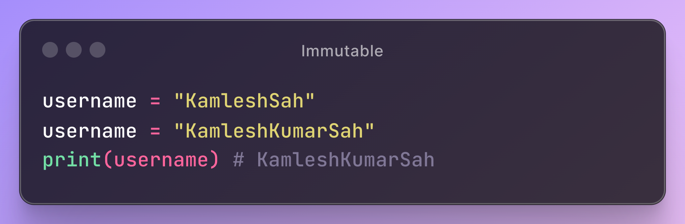

# Mutable and Immutable Objects in Python

## Introduction

This project demonstrates the differences between mutable and immutable objects in Python. It includes examples and visual aids to help understand these concepts better.

## Project Structure

.png)

